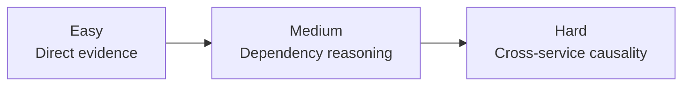
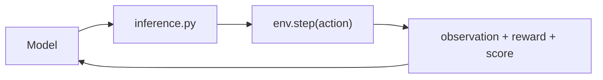

# Unified Incident Env

A deterministic OpenEnv benchmark where agents resolve production incidents whose true root cause includes a security vulnerability.

`unified_incident_env` is one judge-facing environment. It is not a collection of mini-projects and it is not a toy task. Each episode starts as an operational outage, but the correct solution requires the agent to bridge SRE investigation with security remediation, then recover the system in the correct order and submit a postmortem.

## Latest Model Scores

Latest full `python inference.py` run (April 8, 2026) with:

- `MODEL_NAME=Qwen/Qwen2.5-72B-Instruct:novita`
- `API_BASE_URL=https://router.huggingface.co/v1`
- `ENV_BASE_URL=http://127.0.0.1:8000`

| Scenario | Difficulty | Score | Success |
| --- | --- | ---: | --- |
| `database_sqli_outage` | Easy | `0.42` | `false` |
| `cache_abuse_broken_access_control` | Medium | `0.93` | `true` |
| `worker_bad_deploy_command_injection` | Hard | `0.92` | `true` |
| **Mean** | - | **`0.76`** | **`2/3`** |

## Submission Snapshot

Hackathon submission targets:

- GitHub repository: `https://github.com/Madhav-GPT/my-openenv`
- Hugging Face Space: `https://huggingface.co/spaces/Madhav189/my-env`

Submission-critical root files:

- `inference.py`
- `requirements.txt`
- `run_demo.py`
- `README.md`
- `Dockerfile`
- `openenv.yaml`

Checklist coverage:

- built with OpenEnv
- root `inference.py` uses the OpenAI client
- typed models plus `step()` / `reset()` / `state()` are implemented
- 3 deterministic tasks with easy -> medium -> hard progression
- Docker-based Hugging Face Space target is configured
- required inference environment variables are documented below

## Why This Benchmark Matters

Most agent benchmarks test operations or security in isolation. This benchmark forces both:

- operational symptoms appear first
- the real root cause can be security-rooted
- patching alone is not enough
- recovery alone is not enough
- the final postmortem must reflect the real causal chain

This is what makes it useful for evaluating incident-response agents rather than generic tool-using assistants.

## Why It Is Non-Trivial

The benchmark is intentionally built around causal traps:

- restarting the wrong service treats a symptom but does not fix the incident
- patching the wrong vulnerability or wrong patch family wastes steps and score
- recovering infrastructure before closing the exploit path can fail or regress
- weak agents often loop in investigation, security verification, or post-security recovery

Bad agent pattern:

```text
database is down
-> restart database
-> database crashes again because exploit path is still open
```

Good agent pattern:

```text
find root cause
-> unlock security subquest
-> patch exploit path
-> verify fix
-> recover infrastructure
-> submit postmortem
```

## Evaluation Gap

| Property | Simple ops benchmark | Unified Incident Env |
| --- | --- | --- |
| Failure model | broken service only | broken service plus security-rooted cause |
| Agent role | troubleshooter | incident responder plus security repair assistant |
| Action pattern | pure recovery | investigate -> unlock security -> patch -> recover |
| Failure traps | wrong restart | wrong restart plus wrong patch plus wrong order |
| Success condition | service healthy | service healthy plus exploit path closed plus postmortem |

## Benchmark Mechanics

Named mechanics that shape behavior:

- Causal traps
- Stage transitions
- Security unlock
- Recovery ordering
- Negative-reward correction pressure
- Deterministic postmortem scoring

These mechanics are explicit in the environment state and reward function. They are not hidden in a black-box grader.

## At A Glance

| Item | Value |
| --- | --- |
| Environment name | `unified_incident_env` |
| Environment count | 1 |
| Scenario count | 3 |
| Difficulty levels | Easy, Medium, Hard |
| Public actions | 11 |
| Score range | strictly between `0.0` and `1.0` |
| Score type | deterministic, dense, bounded |
| Root runner | `inference.py` |
| OpenEnv validation | passes |
| Test suite | `59 passed` |
| Docker build | passes |
| LLM judge | none |
| Default web entry | `/simple` (terminal-style) |
| Advanced web entry | `/web/` |

## Scenario Pack

| Scenario | Difficulty | Operational failure | Security root cause | Lesson |
| --- | --- | --- | --- | --- |
| `database_sqli_outage` | Easy | database crash causes gateway `502`s | SQL injection in login path | close exploit before restarting database |
| `cache_abuse_broken_access_control` | Medium | cache crash and database degradation cascade | broken access control on internal admin endpoint | follow dependency chain and authorization evidence |
| `worker_bad_deploy_command_injection` | Hard | worker poisons downstream database and gateway | command injection plus bad deploy | stop investigating once enough evidence exists, then patch and rollback the worker path |

Difficulty progression:

```text
Easy   -> direct evidence, short recovery chain
Medium -> dependency reasoning, authorization bug
Hard   -> cross-service causality, exploit plus deploy rollback
```



## Public Action Schema

Only these `action_type` values are valid:

```json
[
  "query_logs",
  "query_metrics",
  "query_dependencies",
  "restart_service",
  "rollback_deploy",
  "inspect_code",
  "classify_vulnerability",
  "apply_patch",
  "verify_security_fix",
  "submit_security_fix",
  "submit_postmortem"
]
```

Required fields:

| Action | Required fields |
| --- | --- |
| `query_logs` | `service` |
| `query_metrics` | `service`, `metric` |
| `query_dependencies` | `service` |
| `restart_service` | `service` |
| `rollback_deploy` | `service` |
| `inspect_code` | none |
| `classify_vulnerability` | `vulnerability_type` |
| `apply_patch` | `patch_id` |
| `verify_security_fix` | none |
| `submit_security_fix` | none |
| `submit_postmortem` | `postmortem` |

## Observation Design

Each step returns a typed observation with:

- `tick_count`
- `workflow_stage`
- `active_alerts`
- `service_health`
- `last_action_result`
- `tool_output`
- `failure_type`
- `why_failed`
- `allowed_actions`
- `required_fields_by_action`
- `valid_action_example`
- `common_trap`
- `loop_warning`
- `blocked_until_security_complete`
- `security_unlock_reason`
- `best_recovery_action_family`
- `progress_flags`
- `security_subquest_status`
- `security_context`
- `final_score`
- `score_breakdown`
- `incident_resolved`
- `reward`
- `done`

This keeps the benchmark deterministic while still making failure states explicit and machine-usable.

## Scoring

The public task score is deterministic and stays strictly between `0.0` and `1.0`.

```text
final_score =
  infrastructure_score (0.00 to 0.45) +
  security_score       (0.00 to 0.35) +
  efficiency_score     (0.00 to 0.10) +
  postmortem_score     (0.00 to 0.10)
```

Score weight view:

| Component | Weight |
| --- | ---: |
| Infrastructure | 0.45 |
| Security | 0.35 |
| Efficiency | 0.10 |
| Postmortem | 0.10 |

Deterministic guarantees:

- preset authored scenarios
- deterministic patch outcomes
- deterministic postmortem scoring
- no hidden fallback in strict benchmark behavior
- no LLM grader
- incomplete security subquest caps the final score at `0.5`

## Runtime Flow

```text
model
  -> inference.py
  -> env.step(action)
  -> observation + reward + score
  -> next model decision
```



Successful episode flow:

```text
diagnosis
-> root cause analysis
-> security subquest
-> remediation
-> verification
-> postmortem
-> done
```

## Inference Path

The root `inference.py` is the submission runner.

It:

- uses the OpenAI client
- reads `API_BASE_URL`, `MODEL_NAME`, and `HF_TOKEN`
- exposes an optional `LOCAL_IMAGE_NAME` variable for docker-image-based local runs
- emits validator-compatible `[START]`, `[STEP]`, and `[END]` logs
- runs all 3 scenarios through the real environment API

Inference modes:

- `INFERENCE_MODE=judge`
  - default
  - compact, strong-model-friendly prompt
  - structured outputs first
  - no transcript stuffing
- `INFERENCE_MODE=small`
  - optional local rescue mode for weaker models
  - compact corrective prompt behavior

## Model Notes

Models used during development and validation:

- `qwen2.5:1.5b`
- `qwen2.5:3b`
- `qwen2.5:7b-instruct-q4_K_M`
- `gemma2:2b`
- `llama-3.3-70b-versatile`

The default path is optimized for strong external judge models. The optional `small` mode exists only to support weaker local models without changing the benchmark contract.

## Repository Layout

```text
.
├── README.md
├── inference.py
├── requirements.txt
├── run_demo.py
├── openenv.yaml
├── Dockerfile
├── pyproject.toml
├── uv.lock
├── Makefile
├── server/
└── unified_incident_env/
```

Important internals:

| Path | Purpose |
| --- | --- |
| `server/app.py` | top-level app entrypoint |
| `unified_incident_env/models.py` | typed action, observation, and state models |
| `unified_incident_env/server/challenge.py` | scenario catalog |
| `unified_incident_env/server/environment.py` | transition logic |
| `unified_incident_env/server/grader.py` | deterministic scoring |
| `unified_incident_env/scripts/baseline_agent.py` | deterministic internal reference baseline |
| `unified_incident_env/tests/` | regression tests |
| `unified_incident_env/trainer/` | optional secondary tooling |

## Running The Repo

Install:

```bash
python3 -m venv .venv
source .venv/bin/activate
python -m pip install -r requirements.txt
```

Editable install with dev extras:

```bash
python -m pip install -e ".[dev]"
```

Run tests:

```bash
pytest unified_incident_env/tests -q
```

Validate OpenEnv compliance:

```bash
openenv validate .
```

Run the environment locally:

```bash
uvicorn server.app:app --host 0.0.0.0 --port 8000
```

Web UI paths:

- `http://127.0.0.1:8000/simple` (default terminal-style flow, START/STEP/END logs)
- `http://127.0.0.1:8000/web/` (advanced OpenEnv UI)

Run the root inference script:

```bash
python inference.py
```

Run the local demo helper:

```bash
python run_demo.py
```

Build and run with Docker:

```bash
docker build -t unified-incident-env .
docker run --rm -p 8000:8000 unified-incident-env
```

## Environment Variables

Mandatory inference variables:

- `API_BASE_URL`
- `MODEL_NAME`
- `HF_TOKEN`

Additional local overrides:

- `ENV_BASE_URL`
- `INFERENCE_MODE`

Example:

```bash
export API_BASE_URL="https://router.huggingface.co/v1"
export MODEL_NAME="Qwen/Qwen2.5-72B-Instruct:novita"
export HF_TOKEN="your_hf_token"
python inference.py
```

## Validation Status

Current repo-level checks:

- `pytest unified_incident_env/tests -q` -> `59 passed`
- `./.venv/bin/openenv validate .` -> `[OK] : Ready for multi-mode deployment`
- `docker build -t unified-incident-env .` -> passes

## Hugging Face Space

Configured Space URL:

- `https://huggingface.co/spaces/Madhav189/my-env`

The repo is structured for a Docker-based Hugging Face Space via `openenv.yaml`.

## Optional Trainer Scaffold

`unified_incident_env/trainer/` is secondary tooling for:

- trajectory collection
- failure analysis
- correction dataset generation
- updater hooks

It is not a second environment. The judge-facing benchmark remains `unified_incident_env`.

## Reading Order

For a new engineer or agent:

1. `README.md`
2. `inference.py`
3. `openenv.yaml`
4. `unified_incident_env/models.py`
5. `unified_incident_env/server/challenge.py`
6. `unified_incident_env/server/environment.py`
7. `unified_incident_env/server/grader.py`
8. `unified_incident_env/tests/`
